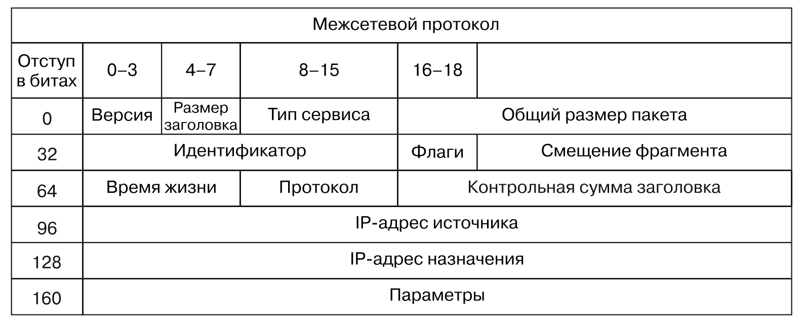

# Sniffer
## Decoding IP
- IP: Interten protocol
- ICMP: Internet Control Message Protocol
Example of sniffer:
```python
import socket
import os
import logging

logging.basicConfig(level=logging.DEBUG)

HOST = '0.0.0.0'


def main():
    # creation of the raw socket and link it to the common interface
    if os.name == 'nt':
        socket_protocol = socket.IPPROTO_IP
    else:
        socket_protocol = socket.IPPROTO_ICMP
    sniffer = socket.socket(socket.AF_INET, socket.SOCK_RAW, socket_protocol)
    sniffer.bind((HOST, 0))
    # making capturing ip header
    sniffer.setsockopt(socket.IPPROTO_IP, socket.IP_HDRINCL, 1)
    if os.name == 'nt':
        # if windows we gonna pass parameters IOCTL to the network driver
        # for turning on non-selective regime
        sniffer.ioctl(socket.SIO_RCVALL, socket.RCVALL_ON)

    # reading one package
    print(f'[INFO] Recieved package: {sniffer.recvfrom(65565)}')

    # if OS is windows, gonna turn off nonselective regime
    if os.name == 'nt':
        sniffer.ioctl(socket.SIO_RCVALL, socket.RCVALL_OFF)


if __name__ == "__main__":
    main()
```
Output:
```python
[INFO] Recieved package: (b'E\x00@\x00\x9a{\x00\x004\x01\xdb\xd6\x05\xff\xffM\n\x08\x01\x03\x00\x00x\xa5\xe6c\x00\x00h\xf8^D\x00\x06\xee\xb0\x08\t\n\x0b\x0c\r\x0e\x0f\x10\x11\x12\x13\x14\x15\x16\x17\x18\x19\x1a\x1b\x1c\x1d\x1e\x1f !"#$%&\'()*+,-./01234567', ('5.255.255.77', 0))
```
## Decoding packages of network level

- ctypes: library of foreign function interface (FFI) in python. By using it we can have a deal with the C code and call functions 
- struct: make a convertion from python to C
### Ip structure through ctypes
```python
# realization through Ctypes
class IP_ctypesStyle(Structure):
    _fields_ = [
        ("ihl", c_ubyte, 4), # 4-bit unsign char type
        ("version", c_ubyte, 4), # 4-bit unsign char type
        ("tos", c_ubyte, 8), # 1-byte unsign char type (type of service)
        ("len", c_ushort, 16), # 2-byte unsign short type
        ("id", c_ushort, 16), # 2-byte unsign short type
        ("offset", c_ushort, 16), # 2-byte unsign short type
        ("ttl", c_ubyte, 8), # 1-byte unsign char type (time to live)
        ("protocol_num", c_ubyte, 8), # 1-byte unsign char type
        ("sum", c_ubyte, 16), # 2-byte unsign short type
        ("src", c_ubyte, 32), # 4-byte unsign int type
        ("dst", c_ubyte, 32), # 4-byte unsign int type
    ]
    def __new__(cls, socket_buffer=None):
        return cls.from_buffer_copy(socket_buffer)

    def __init__(self, socket_buffer=None):
        # human readable IP addresses
        self.src_address = socket.inet_ntoa(struct.pack("<L", self.src))
        self.dst_address = socket.inet_ntoa(struct.pack("<L", self.dst))
```
### Ip structure through class
```python
# realization through Class
class IP_structStyle:
    def __init__(self, buff=None):
        header = struct.unpack('<BBHHHBBH4s4s', buf)
        self.ver = header[0] >> 4
        self.ihl = header[0] & 0xF

        self.tos = header[1]
        self.len = header[2]
        self.id = header[3]
        self.offset = header[4]
        self.ttl = header[5]
        self.protocol_num = header[6]
        self.sum = header[7]
        self.src = header[8]
        self.dst = header[9]

        self.src_address = ipaddress.ip_address(self.src)
        self.dst_address = ipaddress.ip_address(self.dst)

        self.protocol_map = {1: "ICMP", 6: "TCP", 17: "UDP"}
```
# Realization of the sniffer
```python
import ipaddress
import os
import socket
import struct
import sys

HOST = '0.0.0.0'

class IP:
    def __init__(self, buff=None):
        header = struct.unpack('<BBHHHBBH4s4s', buff)
        self.ver = header[0] >> 4
        self.ihl = header[0] & 0xF

        self.tos = header[1]
        self.len = header[2]
        self.iid = header[3]
        self.offset = header[4]
        self.ttl = header[5]
        self.protocol_num = header[6]
        self.sum = header[7]
        self.src = header[8]
        self.dst = header[9]

        self.src_address = ipaddress.ip_address(self.src)
        self.dst_address = ipaddress.ip_address(self.dst)

        self.protocol_map = {1: "ICMP", 6: "TCP", 17: "UDP"}
        try:
            self.protocol = self.protocol_map[self.protocol_num]
        except Exception as e:
            print(f'{e}. No protocol for {self.protocol_num}')
            self.protocol = str(self.protocol_num)


def sniff(host):
    if os.name == 'nt':
        socket_protocol = socket.IPPROTO_IP
    else:
        socket_protocol = socket.IPPROTO_ICMP

    sniffer = socket.socket(socket.AF_INET, socket.SOCK_RAW, socket_protocol)
    sniffer.bind((HOST, 0))
    sniffer.setsockopt(socket.IPPROTO_IP, socket.IP_HDRINCL, 1)

    if os.name == 'nt':
        sniffer.ioctl(socket.SIO_RCVALL, socket.RCVALL_ON)

    try:
        while True:
            raw_buffer = sniffer.recvfrom(65535)[0]
            ip_header = IP(raw_buffer[0:20])
            print(f'[INFO] Protocol: {ip_header.protocol} {ip_header.src_address} -> {ip_header.dst_address}')

    except KeyboardInterrupt:
        if os.name == 'nt':
            sniffer.ioctl(socket.SIO_RCVALL, socket.RCVALL_OFF)
        sys.exit()


if __name__ == "__main__":
    if len(sys.argv) == 2:
        host = sys.argv[1]
    else:
        host = '0.0.0.0'
    
    sniff(host)
```
Output:
```python
sudo /Users/artemdanilisin/opt/anaconda3/bin/python test.py
[INFO] Protocol: ICMP 77.88.44.55 -> 10.8.1.3
[INFO] Protocol: ICMP 77.88.44.55 -> 10.8.1.3
[INFO] Protocol: ICMP 77.88.44.55 -> 10.8.1.3
```

## Decondig ICMP
```python
import ipaddress
import os
import socket
import struct
import sys

HOST = '0.0.0.0'

class IP:
    def __init__(self, buff=None):
        header = struct.unpack('<BBHHHBBH4s4s', buff)
        self.ver = header[0] >> 4
        self.ihl = header[0] & 0xF

        self.tos = header[1]
        self.len = header[2]
        self.iid = header[3]
        self.offset = header[4]
        self.ttl = header[5]
        self.protocol_num = header[6]
        self.sum = header[7]
        self.src = header[8]
        self.dst = header[9]

        self.src_address = ipaddress.ip_address(self.src)
        self.dst_address = ipaddress.ip_address(self.dst)

        self.protocol_map = {1: "ICMP", 6: "TCP", 17: "UDP"}
        try:
            self.protocol = self.protocol_map[self.protocol_num]
        except Exception as e:
            print(f'{e}. No protocol for {self.protocol_num}')
            self.protocol = str(self.protocol_num)


class ICMP:
    def __init__(self, buff):
        header = struct.unpack('<BBHHH', buff)
        self.type = header[0]
        self.code = header[1]
        self.sum = header[2]
        self.id = header[3]
        self.seq = header[4]


def sniff(host):
    if os.name == 'nt':
        socket_protocol = socket.IPPROTO_IP
    else:
        socket_protocol = socket.IPPROTO_ICMP

    sniffer = socket.socket(socket.AF_INET, socket.SOCK_RAW, socket_protocol)
    sniffer.bind((HOST, 0))
    sniffer.setsockopt(socket.IPPROTO_IP, socket.IP_HDRINCL, 1)

    if os.name == 'nt':
        sniffer.ioctl(socket.SIO_RCVALL, socket.RCVALL_ON)

    try:
        while True:
            raw_buffer = sniffer.recvfrom(65535)[0]
            ip_header = IP(raw_buffer[0:20])
            if ip_header.protocol == 'ICMP':
                print(f'[INFO] Protocol: {ip_header.protocol} {ip_header.src_address} -> {ip_header.dst_address}')
                print(f'[INFO] Version: {ip_header.ver}')
                print(f'[INFO] HeaderLength: {ip_header.ihl} TTL: {ip_header.ttl}')

                offset = ip_header.ihl * 4
                buf = raw_buffer[offset:offset+8]
                icmp_header = ICMP(buf)
                print(f'[INFO] ICMP -> Type: {icmp_header.type}, Code: {icmp_header.code}')

    except KeyboardInterrupt:
        if os.name == 'nt':
            sniffer.ioctl(socket.SIO_RCVALL, socket.RCVALL_OFF)
        sys.exit()


if __name__ == "__main__":
    if len(sys.argv) == 2:
        host = sys.argv[1]
    else:
        host = '0.0.0.0'
    
    sniff(host)
```
Output:
```python
[INFO] Protocol: ICMP 77.88.44.55 -> 10.8.1.3
[INFO] Version: 4
[INFO] HeaderLength: 5 TTL: 55
[INFO] ICMP -> Type: 0, Code: 0
```
## Full scanner
```python
import ipaddress
import os
import socket
import struct
import sys
import threading
import time
import logging

logging.basicConfig(level=logging.DEBUG)

# SUBNET = '192.168.1.0/24'
# SUBNET = '192.168.64.0/24'
SUBNET = '77.88.55.0/24'
MESSAGE = 'PYTHONRULES!'

class IP:
    def __init__(self, buff=None):
        header = struct.unpack('<BBHHHBBH4s4s', buff)
        self.ver = header[0] >> 4
        self.ihl = header[0] & 0xF

        self.tos = header[1]
        self.len = header[2]
        self.iid = header[3]
        self.offset = header[4]
        self.ttl = header[5]
        self.protocol_num = header[6]
        self.sum = header[7]
        self.src = header[8]
        self.dst = header[9]

        self.src_address = ipaddress.ip_address(self.src)
        self.dst_address = ipaddress.ip_address(self.dst)

        self.protocol_map = {1: "ICMP", 6: "TCP", 17: "UDP"}
        try:
            self.protocol = self.protocol_map[self.protocol_num]
        except Exception as e:
            print(f'{e}. No protocol for {self.protocol_num}')
            self.protocol = str(self.protocol_num)


class ICMP:
    def __init__(self, buff):
        header = struct.unpack('<BBHHH', buff)
        self.type = header[0]
        self.code = header[1]
        self.sum = header[2]
        self.id = header[3]
        self.seq = header[4]


def udp_sender():
    with socket.socket(socket.AF_INET, socket.SOCK_DGRAM) as sender:
        for ip in ipaddress.ip_network(SUBNET).hosts():
            sender.sendto(bytes(MESSAGE, 'utf-8'), (str(ip), 65212))


class Scanner:
    def __init__(self, host):
        self.host = host
        if os.name == 'nt':
            socket_protocol = socket.IPPROTO_IP
        else:
            socket_protocol = socket.IPPROTO_ICMP
        self.socket = socket.socket(socket.AF_INET, socket.SOCK_RAW, socket_protocol)
        self.socket.bind((host, 0))
        self.socket.setsockopt(socket.IPPROTO_IP, socket.IP_HDRINCL, 1)
        if os.name == 'nt':
            self.socket.ioctl(socket.SIO_RCVALL, socket.RCVALL_ON)

    def sniff(self):
        logging.info('Start of sniffing')
        hosts_up = set([f'{str(self.host)} *'])
        try:
            while True:
                raw_buffer = self.socket.recvfrom(65535)[0]
                logging.info('Recved message')
                ip_header = IP(raw_buffer[0:20])
                if ip_header.protocol == "ICMP":
                    offset = ip_header.ihl * 4
                    buf = raw_buffer[offset:offset+8]
                    icmp_header = ICMP(buf)
                    logging.info('This is ICMP message')
                    if icmp_header.code == 0 and icmp_header.type == 0:
                        logging.info('This icmp_header.code = 3 and icmp_header.type = 3')
                        logging.info(f'Ip address check: {ipaddress.ip_address(ip_header.src_address)}')
                        if ipaddress.ip_address(ip_header.src_address) in ipaddress.IPv4Network(SUBNET):
                            logging.info('Ip address in IPv4Network subnet')
                            logging.info(f'[LEN] raw_buffer: {raw_buffer}, message: {bytes(MESSAGE, "utf-8")}')
                            if raw_buffer[len(raw_buffer)-len(MESSAGE):] == bytes(MESSAGE, 'utf-8'):
                                tgt = str(ip_header.src_address)
                                if tgt != self.host and tgt not in hosts_up:
                                    hosts_up.add(str(ip_header.src_address))
                                    print(f'Host Up: {tgt}')
        except KeyboardInterrupt:
            if os.name == 'nt':
                self.socket.ioctl(socket.SIO_RCVALL, socket.RCVALL_OFF)

            print(f'\nUser interrupted.')
            if hosts_up:
                print(f'\n\nSummary: hosts up on {SUBNET}')
            for host in sorted(hosts_up):
                print(f'{host}')
            print('')
            sys.exit()


if __name__ == "__main__":
    if len(sys.argv) == 2:
        host = sys.argv[1]
    else:
        host = '0.0.0.0'
    
    s = Scanner(host)
    time.sleep(5)
    t = threading.Thread(target=udp_sender)
    t.start()
    s.sniff()
```